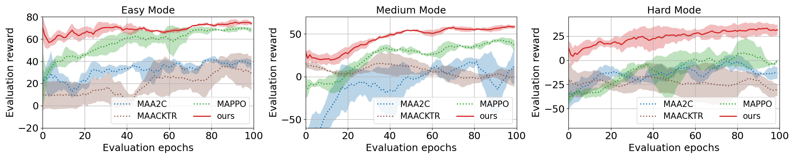

# Deep Multi-agent Reinforcement Learning for Highway On-Ramp Merging in Mixed Traffic

An on-policy MARL algorithm for highway on-ramp merging problem, which features parameter sharing, action masking, local reward design and a priority-based safety supervisor.

## Algorithms

All the MARL algorithms are extended from the single-agent RL with parameter sharing among agents.
- [x] MAA2C: Accessible via email
- [x] MAPPO.
- [x] MAACKTR.
- [x] MADQN: Does not work well.
- [ ] MASAC: TBD.

## Installation
- create an python virtual environment: `conda create -n marl_cav python=3.6 -y`
- active the virtul environment: `conda activate marl_cav`
- install pytorch (torch>=1.2.0): `pip install torch===1.7.0 torchvision===0.8.1 torchaudio===0.7.0 -f https://download.pytorch.org/whl/torch_stable.html`
- install the requirements: `pip install -r requirements.txt`

<p align="center">
     
     <br>Fig.1 Illustration of the considered on-ramp merging traffic scenario. CAVs (blue) and HDVs (green) coexist on both ramp and through lanes.
</p>

## Demo
[see the site](https://drive.google.com/drive/u/1/folders/1437My4sDoyPFsUjrThmlu1oJjTkTkvJ7)

## Usage
To run the code, just run it via `python run_xxx.py`.  The config files contain the parameters for the MARL policies.

## Training curves
<p align="center">
     
     <br>Fig.2 Performance comparison between the proposed method and 3 state-of-the-art MARL algorithms.
</p>

To reproduce, we train the algorithms for 3 random seeds, 0, 2000, 2021. For example, we can set the *torch_seed* and *seed* to 0
to run the seed 0. We can plot the comparison curves with the code: `python common/plot_benchmark_safety.py`

## Cite
```
@article{chen2023deep,
  title={Deep multi-agent reinforcement learning for highway on-ramp merging in mixed traffic},
  author={Chen, Dong and Hajidavalloo, Mohammad R and Li, Zhaojian and Chen, Kaian and Wang, Yongqiang and Jiang, Longsheng and Wang, Yue},
  journal={IEEE Transactions on Intelligent Transportation Systems},
  year={2023},
  publisher={IEEE}
}
```

## Reference
- [Highway-env](https://github.com/eleurent/highway-env)
