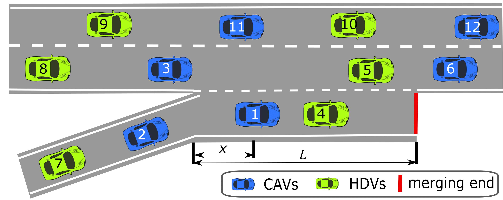

# Deep Multi-agent Reinforcement Learning for Highway On-Ramp Merging in Mixed Traffic

This branch is for the multiple through-lane case as shown in the figure below. More functions and evaluation will be tested and added...

<p align="center">
     
     <br>Fig.1 Illustration of the considered on-ramp merging traffic scenario with multiple through lanes. CAVs (blue) and HDVs (green) coexist on both ramp and through lanes.
</p>


We developed the multiple through-lane case with the reward function as follows.


where $w_c$, $w_s$, $w_h$, $w_m$ and $w_l$ are positive weighting scalars corresponding to collision evaluation $r_c$, stable-speed evaluation $r_s$, headway time evaluation $r_h$, merging cost evaluation $r_m$, and lane-changing evaluation $r_l$, respectively. The goal of the new added lane-changing evaluation $r_l$ is to penalize unnecessary and frequent lane changes to avoid oscillatory driving.


## Usage
To run the code, just run it via `python run_xxx.py`.  The config files contain the parameters for the MARL policies.


## Demo
[see the site](https://drive.google.com/file/d/1W9TLujYiIppCvcUkuq0ViH7MgibpT4GD/view?usp=sharing), we will add more chanllenging test cases in the future.

## Cite
```
@misc{chen2021deep,
      title={Deep Multi-agent Reinforcement Learning for Highway On-Ramp Merging in Mixed Traffic}, 
      author={Dong Chen and Zhaojian Li and Yongqiang Wang and Longsheng Jiang and Yue Wang},
      year={2021},
      eprint={2105.05701},
      archivePrefix={arXiv},
      primaryClass={eess.SY}
}
```

## Reference
- [Highway-env](https://github.com/eleurent/highway-env)


